# README

## Checklist
* README
* ~~Problem Definition~~  
* ~~Problem Solution~~  
  * ~~Ethical Considerations~~
* ~~USER STORIES~~
* WORKFLOW
  * User Diagram
* ~~WIREFRAMES~~
  * ~~Home~~  
  * ~~User Profile~~  
  * Projects list page
  * Project show page   
  * ~~Co-space list page~~
  * ~~Co-space show page~~  
  * ~~Blog feed~~
  * ~~Iphone examples~~  
  * ~~Ipad examples~~  
* ~~ERD~~
* Design Decisions
* Agile Workflow Timetable

-----------------------

### Overview
1. Summary
2. Installation
3. Requirements
4. User Stories
5. Wireframing
6. Workflow Diagram
7. Entity Relationship Diagram
8. Design decisions
9. List of Tools Used
10. Project Plan
11. Future Updates
12. Challenges

-----------------------

### 1. Summary

**Problem:**
* As a freelancer, digital nomad, fledgling actor, garage band or artist, it can often be difficult to find a space to work on projects or practice their skills.

* It can also be hard at times to find projects, theater or collaborations that you would like to participate in.

* On the other hand it can also be difficult sometimes to find people with the right skills to collaborate on a project idea that you have.

* Sometimes as a digital nomad it can be lonely and you want that experience of working in an office environment and the social interaction and sharing of knowledge  that comes with it.

**Proposal:**
* My proposal is to create an app that is similar to air b'n'b that connects people with spaces which are unused, whether that is a desk, a garage, a warehouse or a whole office with those people who find it hard to find a space to work/rehearse from.

* An extra feature of my app will be the ability to post what project you are working on and advertise whether you need people to come on board with your idea. This will create a gumtree style listing of current projects people are working on making it easier for people to find projects that they think they would like to be a part of.

* In essence my app will be a social networking app with a goal of connecting freelancers together through collaborative projects or shared co-working spaces.

**What is your USP (unique selling point)? Why should people use your app rather than the competition?**

* First and foremost, there is nothing out there like it so far (to my best knowledge).

* Project leaders or co-working space hosts will be able to create blog posts that increase their exposure to freelancers.

* Renting out the extra two desks in a office that are always unused will generate extra income for a business

* Providing a platform for the creative arts to connect and find rehearsal spaces will create more community and more opportunity for artists, actors and musicians

* I want to put an emphasis on the social networking side of the app in being able to connect people with ideas and collaborations.

**What are the potential issues (technical/ethical/legal) around your idea?**

* Freelancers and people using the space that has been offered by the host could potentially misuse the share-space

* Sharing projects online could potentially leave the project open to the masses who could steal their ideas

* An established office that has spare desks might leave themselves exposed to people who are not apart of that business/company

-----------------------
### 2. Installation
Configuration - you will not have an ENV file as this has been ignored through Git. In order to run the App you will need to create a .env file with your own mailgun and stripe API keys.

1. Clone the repo then change into the directory.
2. Run **bundle install** in terminal.
   - If you are using windows, run **gem uninstall bcrypt** in CLI and select option 2 (To Uninstall ...x86-mingw32)
3. Run **rails db:create**(To build the database.) **rails db:migrate**(TO generate the tables) in terminal.
4. Run **db:seed** to populate the website.
5. Run **rake geocode:all CLASS=Address** in CLI until there are no API query failures.
5. Create a .env file in the root of the directory, then add your own ENV variables :
   - `STRIPE_PUBLISHABLE_KEY=XXXX`
   - `STRIPE_SECRET_KEY=XXXX`
   - `POSTGRES_PASSWORD=XXXX`
   - `MAILGUN_API_KEY=XXXX`
   - `MAILGUN_DOMAIN_KEY=XXXX`
6. Launch the server, crack a beer while you are waiting for it to load and enjoy watching the $$$ roll in!

 -----------------------
 ## 3. Requirements
 1. Create your application using Ruby on Rails
 2. Demonstrate knowledge of Rails conventions.
 3. Use postgresql database in development.
 4. Use an API (eg. Omniauth, Geocoding, Maps, other..).
 5. Use appropriate gems.
 6. Use environmental variables to protect API keys etc.
 7. Implement a payment system for your product.
 8. Your app must send transactional emails (eg. using Mailgun).
 9. Your app should have an internal user messaging system.
 10. Your app will have some type of searching, sorting and or filtering capability.
 11. Your app will have some type of file uploading capability (eg. images).
 12. Your app will have authentication (eg. Devise, must have full functionality in place).
 13. Your app will have authorisation (users have restrictions on what they can see and edit).
 14. Your app will have an admin dashboard for the admin user to administrate the site.
 15. Document your application with a README that explains how to setup, configure and use your application.

 -----------------------
 ## 4. User Stories
 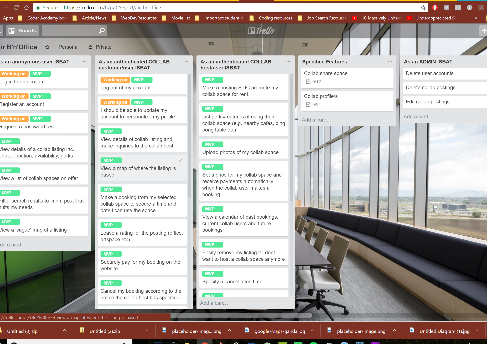
 

 -----------------------

 ## 5. Wireframing
 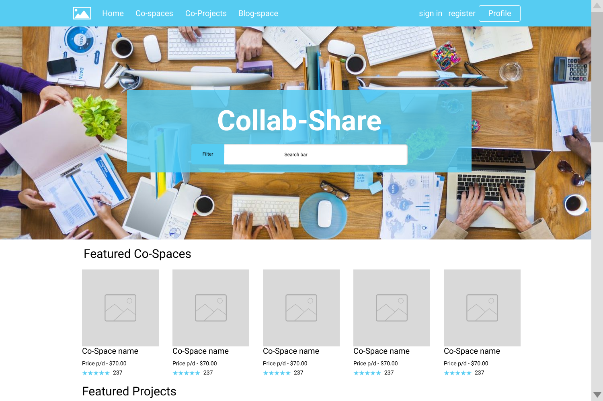
 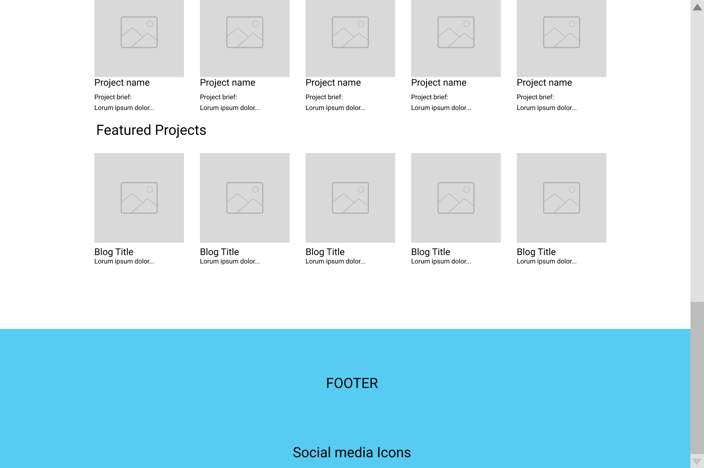

 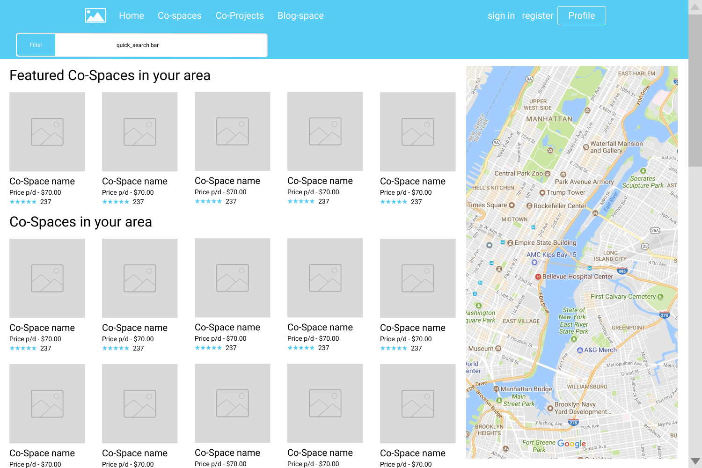

 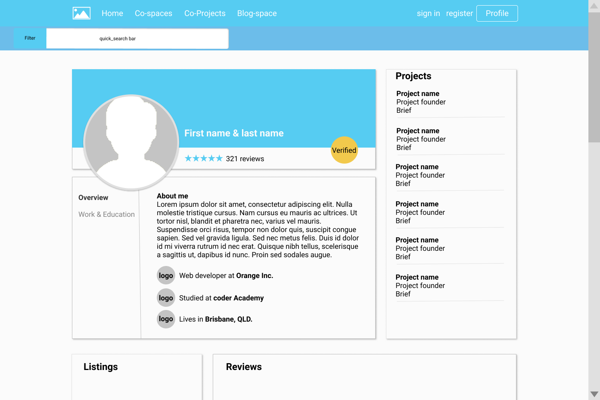

 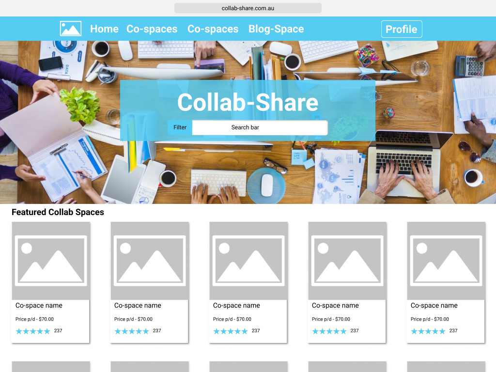

 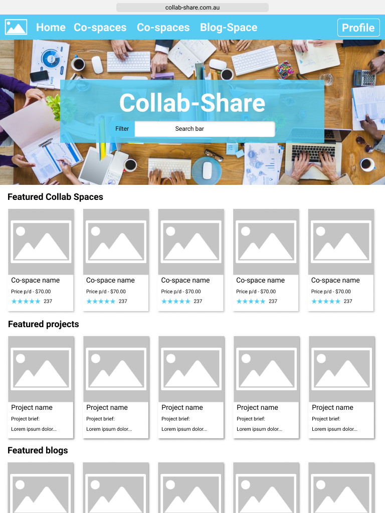

 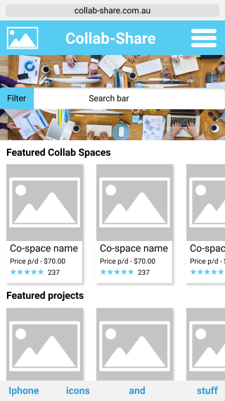

 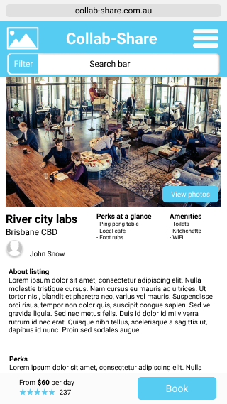

 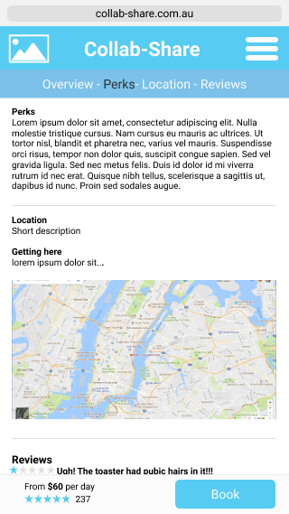

 -----------------------

 ## 6. Workflow Diagram
 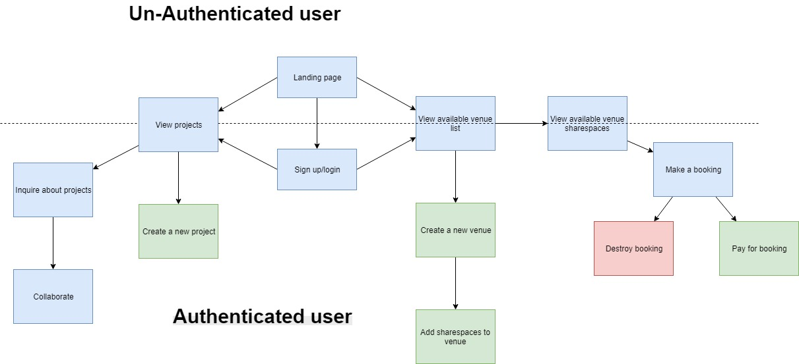

 -------------

 ## 7. Entity Relationship Diagram
 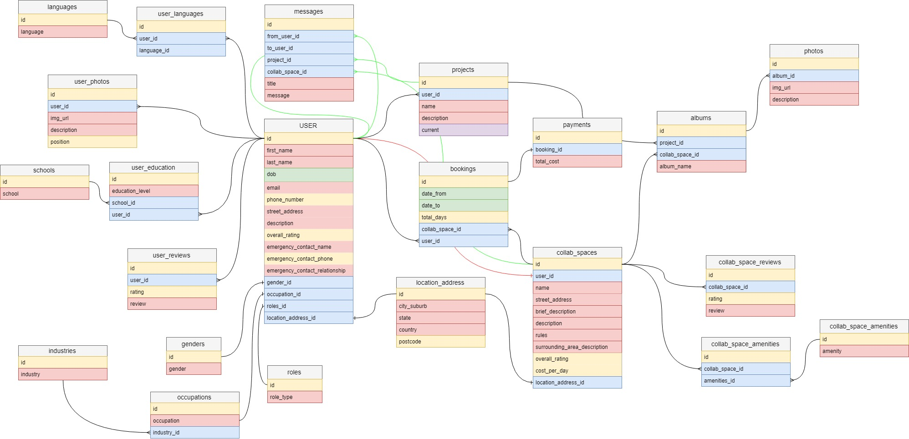

 ----------------

  ## 8. Design decisions
  I chose to go with a light blue color scheme as most research says that the color blue is synonymous with trust and confidence. I went for a lighter shade to represent a youthful presence. I wanted the website to be accessible to both corporate and artistic people.

  

  ----------------
 ## 9. List of Tools Used

 Gems used
  1. Devise - authentication gem
  2. Cloudinary - Cloud image hosting gem
  3. Carrierwave - File/Image uploader gem
  4. Rolify - authorisation gem
  5. Stripe - payments
  6. dotenv-rails - environmental variables
  7. geocoder - longitude latitude geocoding

 1. Github - Version control, user stories and to assign story points for project management.
 2. [Draw](https://www.draw.io) - ERD tool
 3. postgresql - Database
 4. Heroku - Webhosting
 5. Sendgrid - emails
 6. Figma - wireframing
 7. Google Maps - map locations
 8. [Adobe - Color](https://color.adobe.com)
 9. 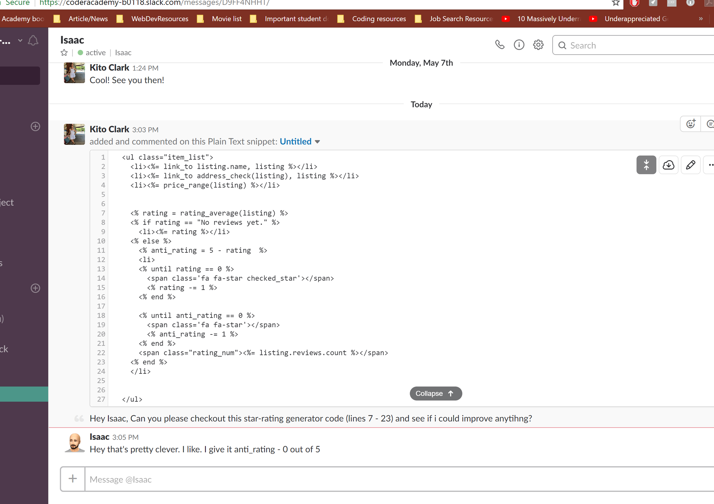

 ------------------

 ## 10. Project Plan
 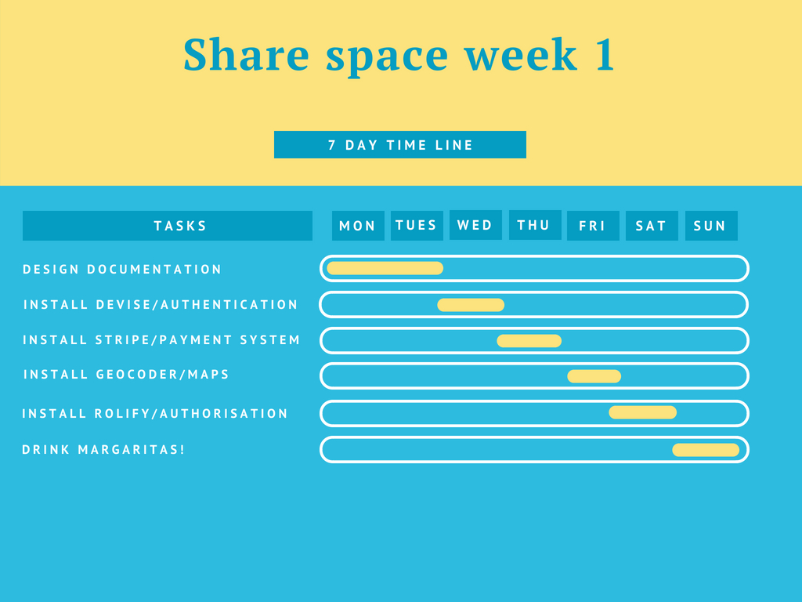
 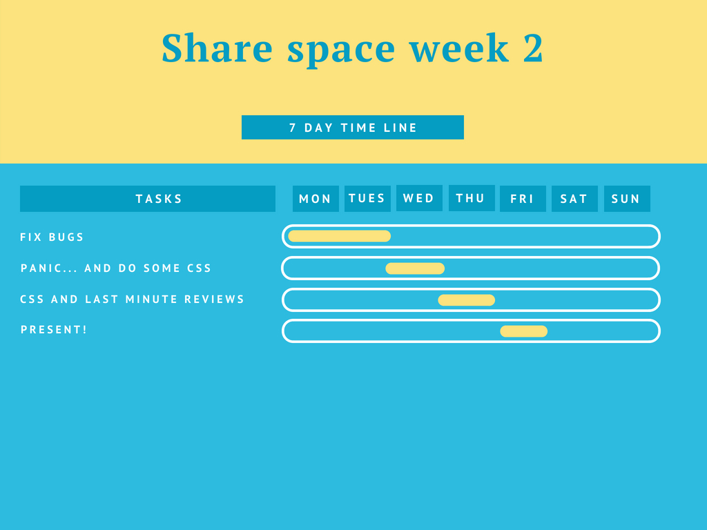

 -------------------
 ## 11. Bugs/Future Updates

 Future updates
 1. Finish implementation of user data
 2. Follow through with Project page
 3. Implement a messaging system

 Bugs
 --- No know bugs as of yet...

 ------------------

 ## 12. Challenges
1. Rendering pages with parameters.
2. Passing parameters through links
3. Learning SASS
